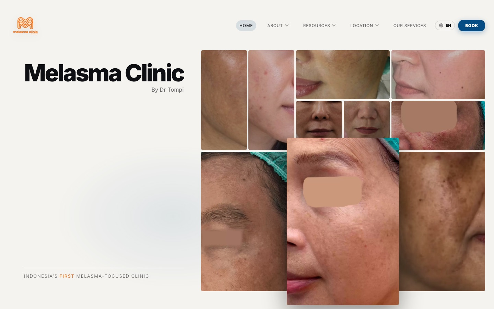

# Melasma Clinic by Dr. Tompi

The first website for **Melasma Clinic**, a new chain of dermatology clinics in Indonesia. I designed and built it over the summer of 2026.

**Live site: [melasmaclinicbydrtompi.com](https://melasmaclinicbydrtompi.com)**
**Case study: [dakari.dev/projects/clinic.html](https://dakari.dev/projects/clinic.html)**



## About the project

Before this site, Melasma Clinic relied only on Instagram and TikTok to advertise, and patients booked through WhatsApp. The clinic needed its own website to show potential patients what treatments it offers and give them an easier way to book, while still ending in WhatsApp so the clinic's admin could finish scheduling.

The new clinics are also easy to reach from Singapore and Malaysia, but most of the clinic's content was in Indonesian, so the site needed to work in both English and Indonesian.

I did everything except the content, which came from the clinic's marketing team. Once the site was handed off, the marketing team took over managing it, so the live site may have changed since the last commit here. This repo is the site as I built and handed it off.

## What's on the site

- **Home:** a grid of before-and-after results instead of a photo of Dr. Tompi, so the results speak for themselves.
- **Services & Treatments:** 19 treatment pages, sorted into six categories so patients can quickly find what they're looking for.
- **Booking:** the Book button opens a list of clinic locations, and each one leads straight to that clinic's WhatsApp.
- **Locations:** Pekanbaru and Semarang are open, with more cities coming soon.
- **About, Resources, and FAQ:** the clinic, its doctors, the wider Beyoutiful Group, and info on melasma and other skin conditions.
- **English and Indonesian:** a language toggle in the top bar switches the whole site, and remembers your choice.

## Built with

- Plain HTML, CSS, and JavaScript. No framework and no build step.
- [Inter](https://fonts.google.com/specimen/Inter) for all text.
- Designed in Figma, built with help from Claude Code.

## Project structure

```
.
├── index.html            # Home page
├── services.html         # Services & Treatments overview
├── location.html         # Clinic locations
├── faq.html
├── about/                # About Melasma Clinic, Beyoutiful Group, Our Doctors
├── resources/            # Resource Center and articles
├── treatments/           # One page per treatment
├── styles.css            # All styles
├── app.js                # Navigation, dropdowns, service tabs, scroll reveals
├── i18n.js               # English/Indonesian toggle and all Indonesian text
├── assets/               # Logos and photos (WebP)
└── docs/preview.jpg      # Screenshot used in this README
```

## Run it locally

No install needed. Open `index.html` in a browser, or start a local server from the project folder:

```bash
python3 -m http.server 8000
```

Then visit http://localhost:8000.

## Making changes

**Editing Indonesian text.** English is written directly in the HTML. Anything translatable has a `data-i18n` (plain text) or `data-i18n-html` (text with markup) attribute, and its Indonesian version lives under the same key in `translations.id` in `i18n.js`. To change the Indonesian copy, just edit that key's value.

**Adding a page.** Copy an existing page in the same folder so you get the top bar, language toggle, and footer. Then add the new page to the footer on every page, and add its `data-i18n` keys to `i18n.js`.

**Adding a location.** Add a chip to `.topbar__bookDrop` on every page and to `.treatBook__dropdown` on each treatment page, then add a location card to `location.html`.

**Adding a treatment photo.** Treatment pages without a photo show a placeholder icon at the same size, so dropping a photo into `.treatImage__img` (and `.svcCard__img--img` on `services.html`) won't shift the layout.

## Credits

- Content provided by Melasma Clinic's marketing team.
- Photos, logos, and treatment results belong to Melasma Clinic and the Beyoutiful Group.

## License

The code is free to look through and learn from. The clinic's name, logos, photos, and written content belong to Melasma Clinic by Dr. Tompi and may not be reused without permission.
